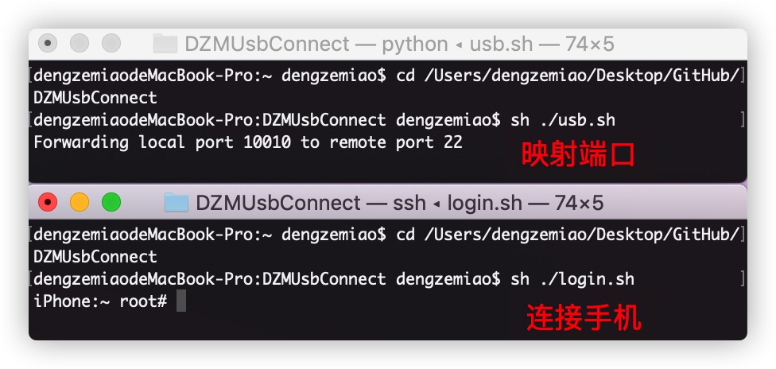

# DZMUsbConnect
【越狱-逆向】将USB连接越狱手机封装成可以 .sh 脚本，方便端口映射以及通过USB连接越狱手机。

### 使用方式

*  1、1、下载 `DZMUsbConnect` 后，电脑 `usb` 链接越狱手机，打开 `命令行`，`cd` 到 `DZMUsbConnect` 文件夹

*  2、映射端口

    ```
    $ sh ./usb.sh
    ```
    
*  3、通过 usb 登录连接手机

    ```
    $ sh ./login.sh
    ```
    
    
